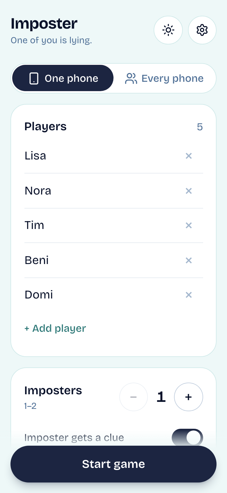
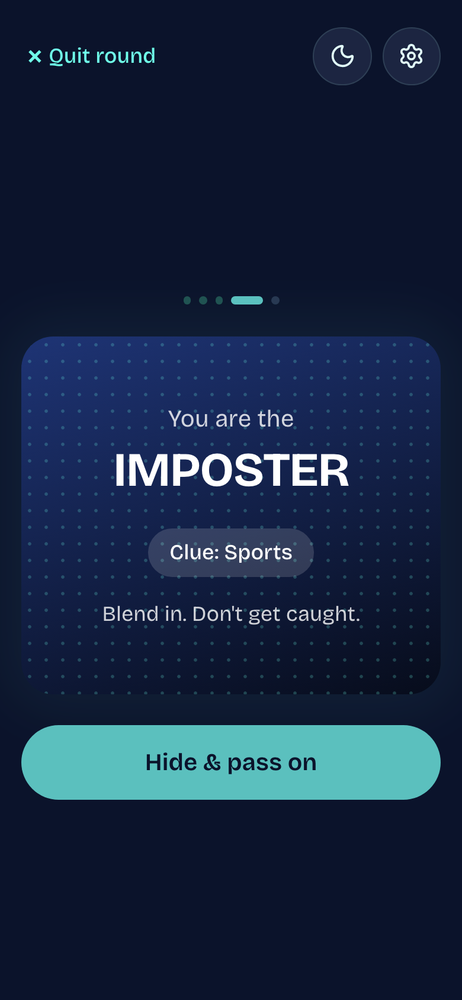
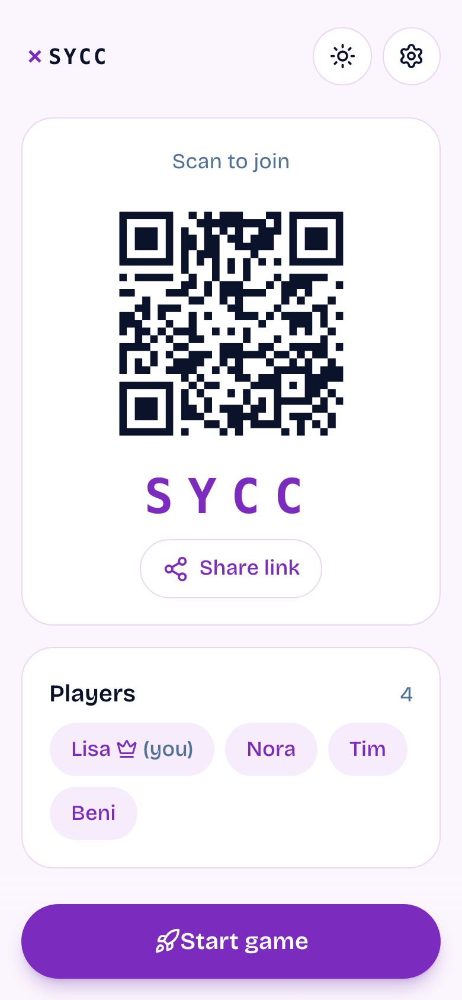
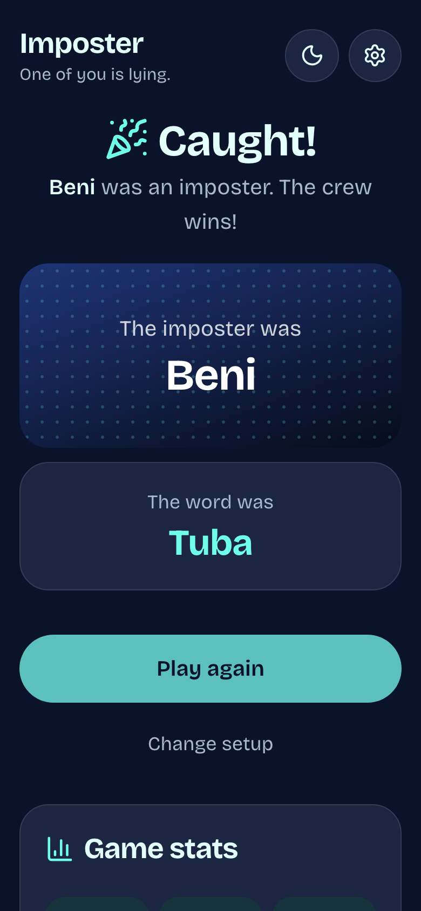
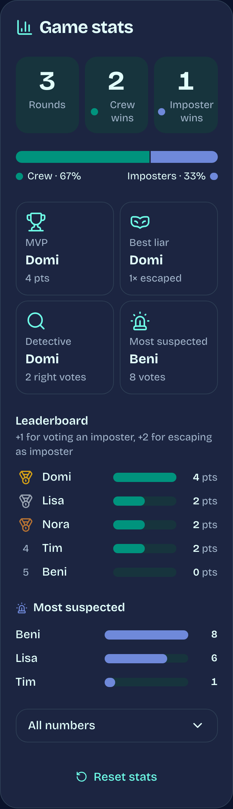

<div align="center">

# Imposter

**One of you is lying.** A party game for your phone, in English, French and German.

[**Play now → imposter-orcin-five.vercel.app**](https://imposter-orcin-five.vercel.app)

&nbsp;
&nbsp;
&nbsp;


</div>

## How to play

1. Everyone gets the same secret word, except the **imposter**, who only gets the topic (or nothing).
2. Take turns saying one word about the secret. Don't make it too easy: the imposter is listening.
3. Vote for who you think the imposter is. A tie means you discuss again.
4. Caught? The crew wins. Wrong person? The imposters win.

## Features

- **Two ways to play**
  - **One phone:** pass it around. Each player taps to see their card, then hides it for the next.
  - **Every phone:** the host creates a room, and everyone else joins with a 4-letter code, a shared link or by **scanning the QR code** in the app. Each phone only ever receives its own card.
- **1,040 words across 26 topics**, from Food and Animals to Switzerland, Space and Fantasy, all in EN/FR/DE with Swiss German wording (Velo, Glace, Gipfeli).
- **Your own words:** each player secretly writes words and hints, then the game draws from them. Whoever wrote a word is never the imposter for it.
- **AI help (on by default, optional):** words players write themselves are checked on submit. Typos are autocorrected, words that are too hard are rejected, and if someone writes a word another player already wrote (exactly or with the same meaning), both are cancelled and both players write a new one. A crew member who doesn't know their word can tap **Explain with AI**. Built with the [Vercel AI SDK](https://ai-sdk.dev) and OpenAI.
- **Joker mode:** an imposter who survives a vote earns a joker. Next time they're the imposter, they get a hint for the word (`S _ _ _ _ _`, or the writer's hint).
- **Multiple imposters**, an optional topic clue for the imposter, and topics you can pick or pick all.
- **Stats after every round:** leaderboard, crew vs. imposter wins, awards (MVP, best liar, detective, most suspected) and charts.
- **Settings:** light / dark / auto, four color themes (Night, Classic, Forest, Berry) and three languages.
- **Built for phones:** big tap targets, safe areas, reduced-motion support, and you can add it to your home screen. A reload or accidental Back resumes the game where you left off.

<p align="center"></p>

## Tech

| | |
|---|---|
| App | [Next.js 16](https://nextjs.org) (App Router) · React 19 · TypeScript · Tailwind CSS 4 |
| Online rooms | Route handlers + [Upstash Redis](https://upstash.com). Roles are computed on the server, and phones check for updates every 1.5 s |
| AI | [AI SDK](https://ai-sdk.dev) + OpenAI (`OPENAI_API_KEY`, model `OPENAI_MODEL`, default `gpt-6-luna`), called only from the server, rate-limited per client |
| Icons / QR | [lucide-react](https://lucide.dev) · `qrcode` · `jsqr` (only loaded when you scan) |
| Tests | `node:test` unit tests · [Playwright](https://playwright.dev) end-to-end tests on a phone viewport, including a fake camera for the QR scanner |
| Hosting | [Vercel](https://vercel.com) |

```
src/
  app/page.tsx            one-phone game + setup
  app/r/[code]/page.tsx   online room (one per phone)
  app/api/rooms/          create / join / act / view
  components/             settings sheet, scanner, stats, joker, icons
  lib/game.ts             rounds, word picking, jokers
  lib/room.ts             room state machine (server)
  lib/i18n.ts, topics.ts, vocab.ts   texts + word lists
```

## Development

```bash
npm install
npm run dev          # http://localhost:3000, online rooms use an in-memory store
npm test             # unit tests
npm run e2e          # Playwright end-to-end tests (starts the dev server)
```

### Online rooms with real Redis locally (like on Vercel)

`scripts/upstash-local.mjs` serves Upstash's REST API from a local Redis:

```bash
redis-server --port 6380 --daemonize yes
npm run redis:local
export UPSTASH_REDIS_REST_URL=http://localhost:8079 UPSTASH_REDIS_REST_TOKEN=local
npm run build && npx next start -p 3100
BASE_URL=http://localhost:3100 npm run e2e
```

### Deploying

Vercel with the Upstash for Redis integration, which sets `KV_REST_API_URL` / `KV_REST_API_TOKEN`, plus `OPENAI_API_KEY` for AI help. Without Redis, the one-phone game works, online rooms answer "not available yet", and AI stays off: its rate limit needs shared storage. Without an OpenAI key, word checks fall back to exact duplicates only.
