# Imposter: user manual

**Play:** [whoislying.ch](https://whoislying.ch). Works in any phone browser. Tip: add it to your home screen.

**Contents**
1. [The idea in 30 seconds](#1-the-idea-in-30-seconds)
2. [Playthrough: one round on one phone](#2-playthrough-one-round-on-one-phone)
3. [Setting up a game](#3-setting-up-a-game)
4. [Voting, results and stats](#4-voting-results-and-stats)
5. [Your own words and AI help](#5-your-own-words-and-ai-help)
6. [Joker mode](#6-joker-mode)
7. [Playing on everyone's phone](#7-playing-on-everyones-phone)
8. [Settings](#8-settings)
9. [Tips, house rules and FAQ](#9-tips-house-rules-and-faq)

---

## 1. The idea in 30 seconds

- Everyone gets the **same secret word**, except the **imposter**, who doesn't.
- Taking turns, every player says **one word** that fits the secret. Too vague and you look suspicious. Too obvious and the imposter learns the word.
- The imposter has to bluff along and work out the word from what the others say.
- Then everybody **votes**. If you catch the imposter, the crew wins. If you pick an innocent player, the imposters win.

You need **3 or more players**. There are two ways to play:

| One phone | Every phone |
|---|---|
| One phone goes round the table; each player looks at their card and hides it again. | Everyone joins a room on their own phone with a code or QR code. Nothing gets passed around. |

---

## 2. Playthrough: one round on one phone

Here's a full round with 4 friends: Lisa, Nora, Tim and Beni (the app's default players).

### Step 1: Setup
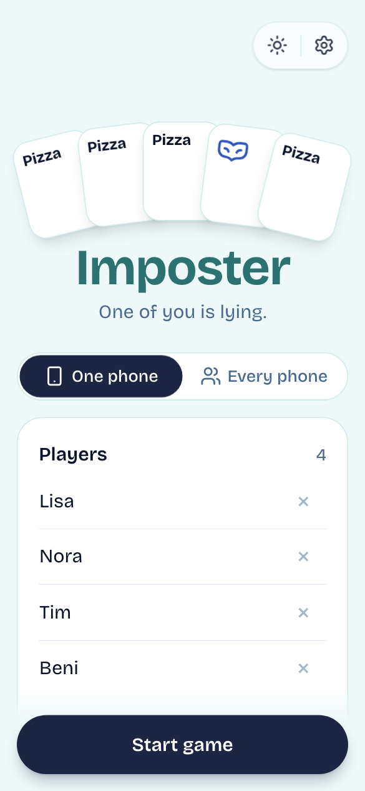

Open the app. The player list is already filled in: type over the names, remove players with **×**, or add more with **+ Add player**.

Leave **Imposters** at 1 and keep **Imposter gets a clue** on for a first game.

Tap **Start game**.

 

### Step 2: Pass the phone
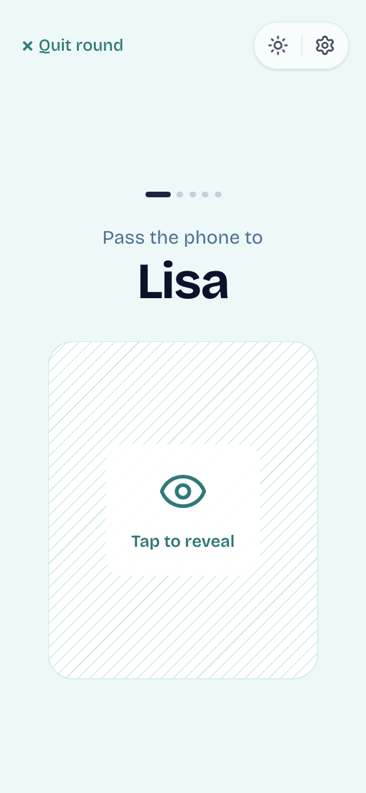

The phone tells you whose turn it is: *"Pass the phone to Lisa"*. Only Lisa looks. She taps the card.

The dots at the top show how many players have seen their card.

 

### Step 3: Look at your card
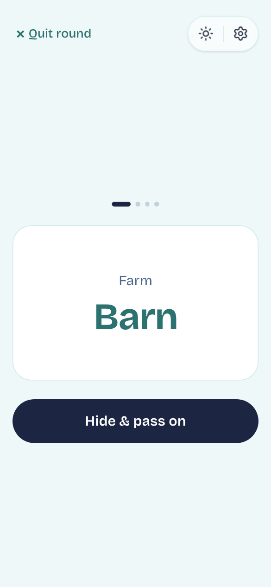
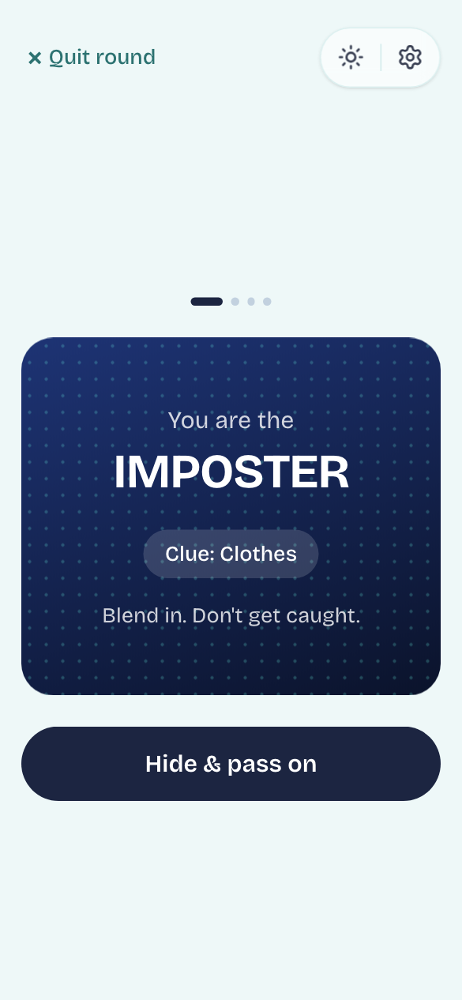

The **crew** see the secret word, with its topic above it.

The **imposter** sees **"You are the IMPOSTER"**, plus the topic as a clue when that setting is on.

Remember what you saw, tap **Hide & pass on**, and hand the phone to the next player. Repeat until everyone has seen their card.

 

### Step 4: Discuss
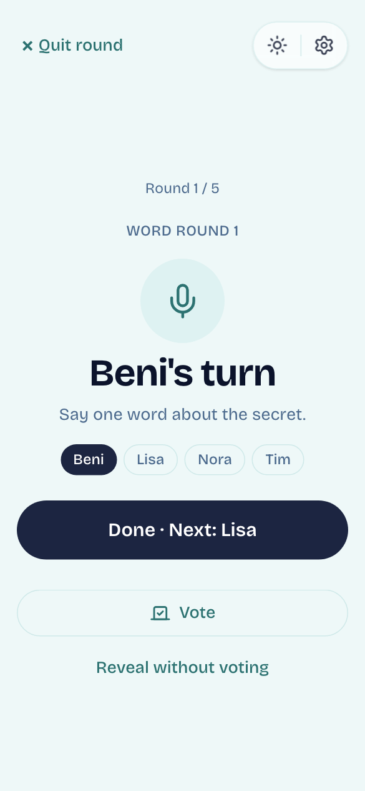

The app picks who **starts** and guides the turns: the screen shows whose turn it is and who's next. Everyone says **one word** about the secret, then taps **Done** to hand over. The phone can lie on the table during this part.

Example (secret word *Beach*): Lisa: "sand", Nora: "towel", Tim (the imposter, clue *Places*): "sunny"… Beni: "waves".

Tap **Another round of words** if nobody's sure yet. When you're ready, tap **Vote**.

 

### Step 5: Vote in secret
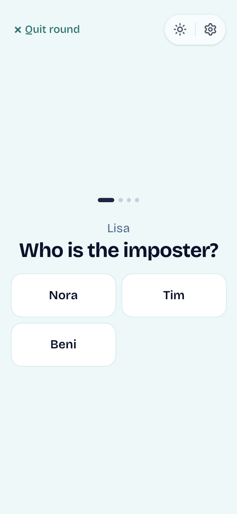

The phone goes round once more. Each player taps **Tap to vote**, then taps the name they suspect. You can't vote for yourself.

If you'd rather decide out loud, tap **Reveal without voting** on the discuss screen instead.

 

### Step 6: The result
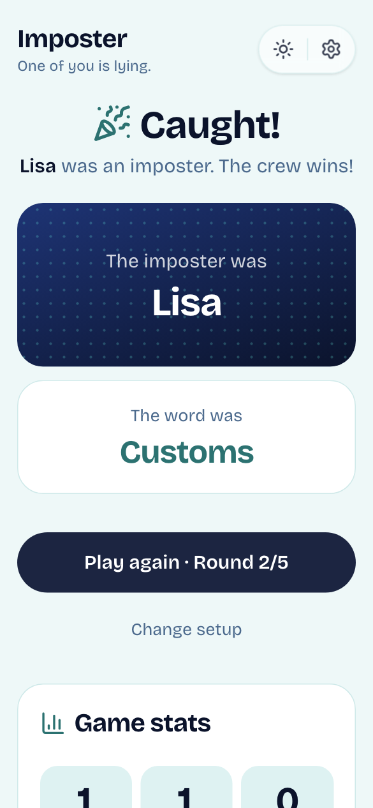

- **Caught!** The player with the most votes was an imposter, so the crew wins.
- **Wrong one!** They were innocent, so the imposters win.
- **It's a tie!** Nobody got the most votes. Talk again, then vote again.

The card shows who the imposter was and what the word was. Tap **Play again** for the next round, or **Change setup**.

 

---

## 3. Setting up a game

| Setting | What it does |
|---|---|
| **Players** | 3 or more. Names can be changed at any time between rounds. |
| **Imposters** | 1 up to half the players. With 2 or more, the imposters don't know about each other. |
| **Imposter gets a clue** | The imposter sees the topic, or the writer's hint for your own words. Turn it off for a harder game. |
| **Joker mode** | See [section 6](#6-joker-mode). Only available when the clue is off. |
| **Words** | **Word packs** (1,080 ready-made words) or **Our own words** ([section 5](#5-your-own-words-and-ai-help)). |
| **Rounds** | 1–30 rounds per game. After the last round the game shows the winner and offers **New game**. |
| **Imposter can guess** | A caught imposter gets one guess at the secret word. Right guess = the imposters win anyway. |
| **Word language** | Language of the secret words: **Auto** (same as the app), **EN**, **FR** or **DE**. The app itself stays in each player's language, so a German-speaking group can play with English words. |
| **Topics** | 27 topics, from Food, Animals and Switzerland to Space, including **Nerd** (tech, gaming, sci-fi). All are on by default. The first 8 show right away (A–Z); **More topics** opens the rest. Pick any mix, or **All topics**. |

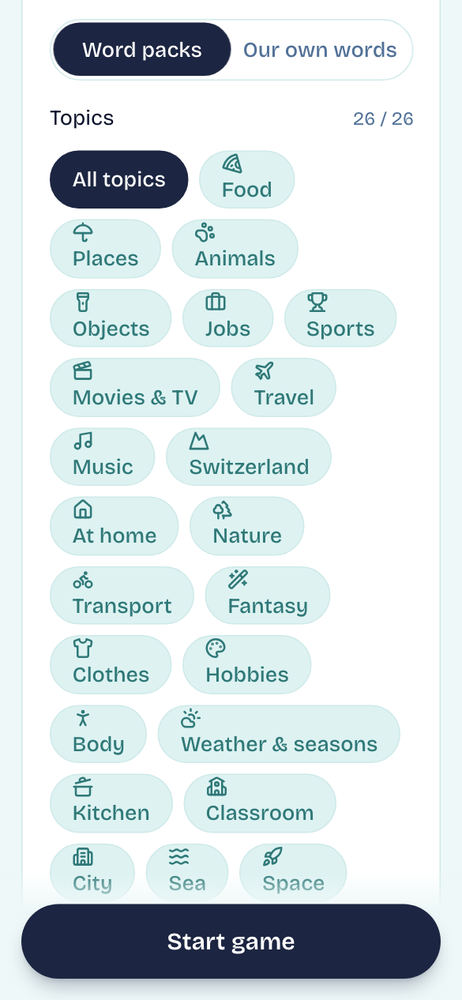

Words from a topic don't repeat until every word in it has been played.

---

## 4. Voting, results and stats

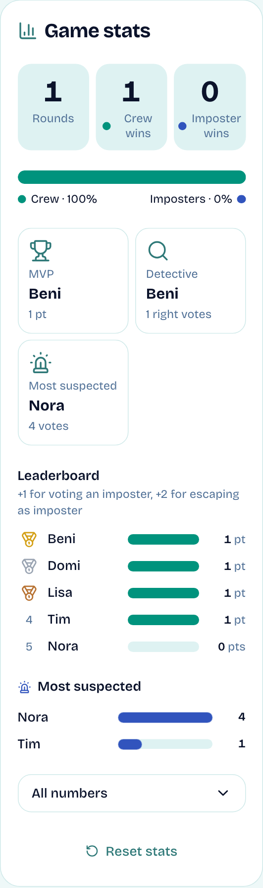

After every round, **Game stats** shows the whole session so far:

- **Rounds**, **Crew wins** and **Imposter wins**, plus a bar showing the split.
- **Awards:** MVP (most points), Best liar (escaped most often as imposter), Detective (most correct votes) and Most suspected (most votes received).
- **Leaderboard** with points:
  - **+1** for voting for an actual imposter
  - **+2** for surviving a vote as the imposter
- **Points per round:** one bar per player, built from the rounds that scored (lighter = earlier rounds), so you see how each total came together.
- **Times imposter:** how often each player got the imposter card.
- **All numbers:** the full table below the charts, shaded like a heatmap: the stronger the colour, the higher the value in that column. The top value of each column is a solid cell, and a legend under the table explains the icons.

**Reset stats** starts a fresh session: scores and jokers go back to zero.

 

---

## 5. Your own words and AI help

Choose **Our own words** and set **Words per player** (1–10). Before the round, every player secretly writes their words, plus an optional hint.

- One word from everyone's words is drawn at random each round. **Whoever wrote it is never the imposter for it**, since they already know it.
- When all the words have been played, the game asks for new ones.

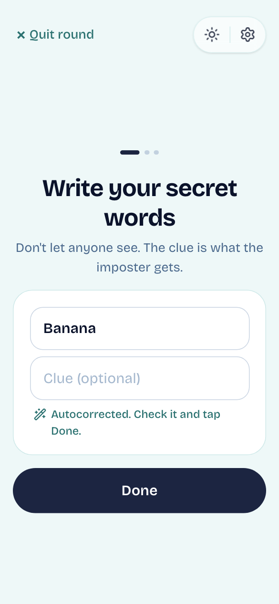

**AI help** (on by default, needs sign-in, see [section 8](#8-settings)) checks every word when you tap **Done**:

- **Typos are autocorrected**, for example *Bananna* → *Banana*. Check the correction and tap Done again.
- **Too hard?** Very obscure or technical words are rejected. Pick one most people know.
- **Duplicates cancel each other.** If you write a word someone already wrote, or one with the same meaning (*Car* / *Auto*), **both are cancelled**. You now know their word, so it can't be played. You write a new one straight away, and the other player gets a message asking them for a new one too.

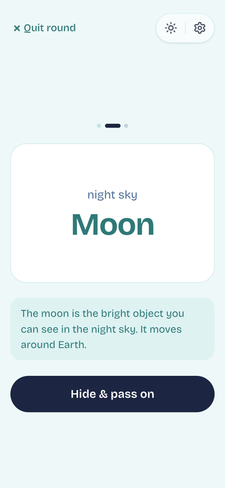

**Don't know a word?** Crew members can tap **Explain with AI** under their word to get a short explanation. The imposter doesn't get this button.

Without AI (switched off, not signed in, or offline), exact duplicates are still caught. When you're not signed in, the AI buttons don't appear at all.

**In a room, AI follows the host:** if the host is signed in (with AI help on), every player in the room gets the word checks and **Explain with AI**, without signing in themselves. The lobby shows *AI help* under *Game settings*. If the host isn't signed in, nobody in that room gets AI, not even a signed-in guest.

 

---

## 6. Joker mode

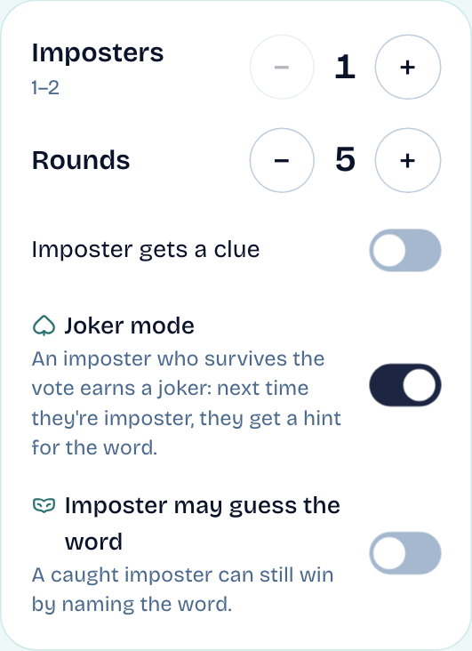

Turn off **Imposter gets a clue**, then turn on **Joker mode**.

- An imposter who **survives a vote** (the group accused someone else) **earns a joker**. The result screen shows who earned one.
- The **next time** they're the imposter, the joker is used up automatically, and their card shows a **hint for the word**:
  - word packs: the first letter plus a blank for each letter, like `S _ _ _ _ _ _`
  - your own words: the writer's hint, which becomes required in joker mode
- Skipping the vote earns nobody a joker.

 

---

## 7. Playing on everyone's phone

### Create a room (the host)
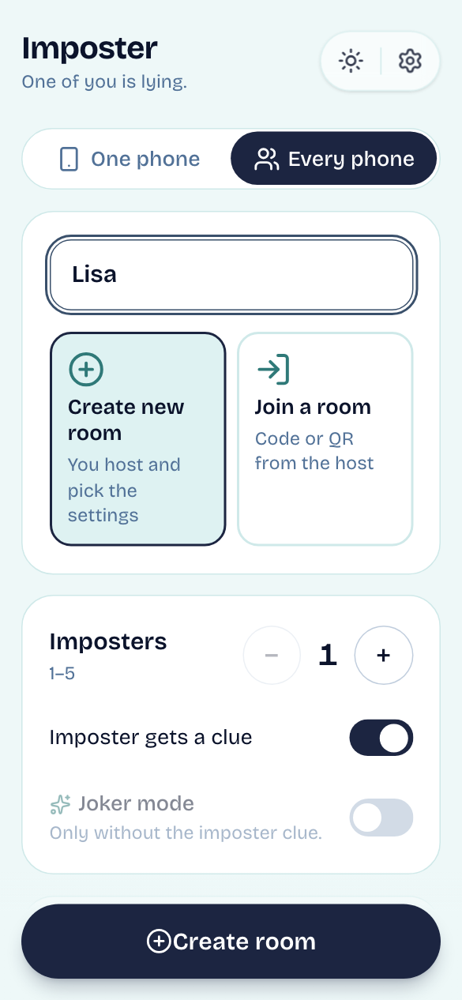

1. Tap **Every phone** (*Mehrere Handys* in German), enter **your name**, and choose **Create new room**.
2. Pick the settings (imposters, topics, own words…) as usual.
3. Tap **Create room**.

 

### Invite the others
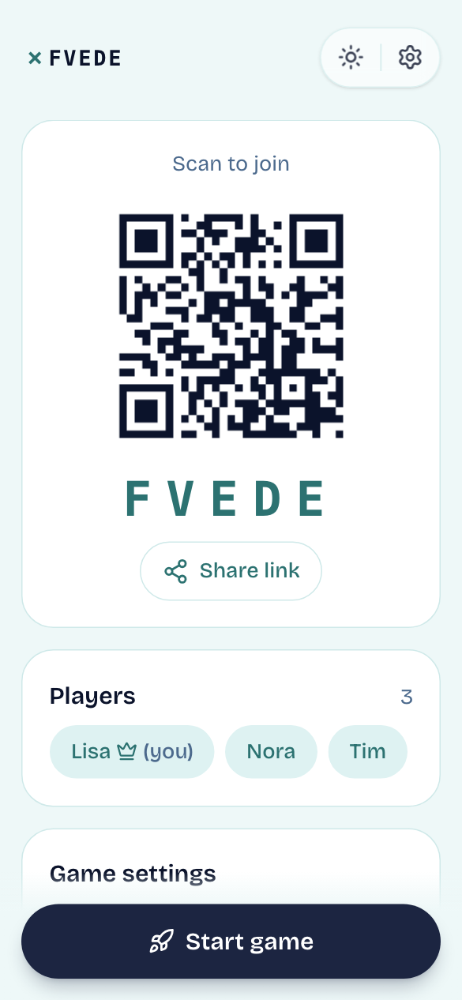

The lobby shows a **5-character code** and a **QR code**. Friends can:

- scan the QR code with their phone camera, or
- tap **WhatsApp** to send the invite straight into a chat, or **Share link** for any other app, or
- open the app, choose **Join a room**, and type the code or tap the **scan** button next to it.

Players appear in the lobby as they join. Once there are 3 or more, the host taps **Start game**.

 

### Join a room
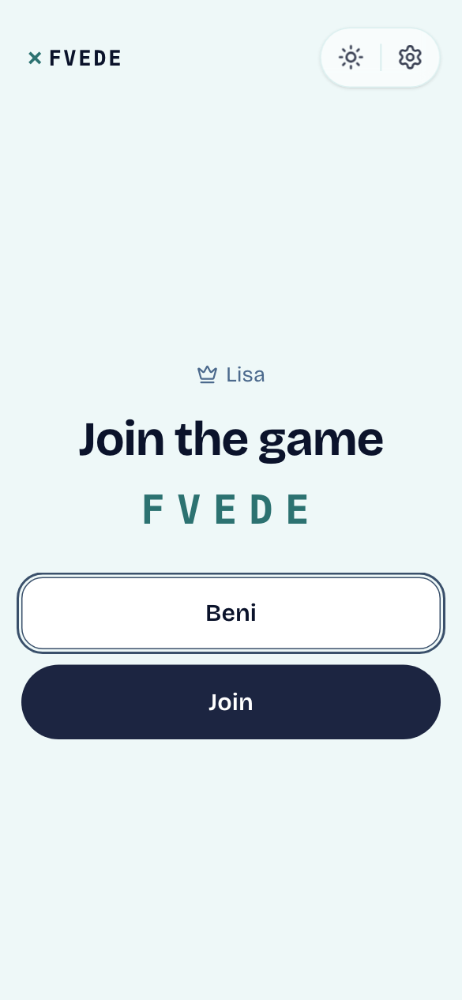

Enter your name and the code (or scan it), then tap **Join**. Once a game has started, nobody else can join. Start a new room instead.

 

### During the game
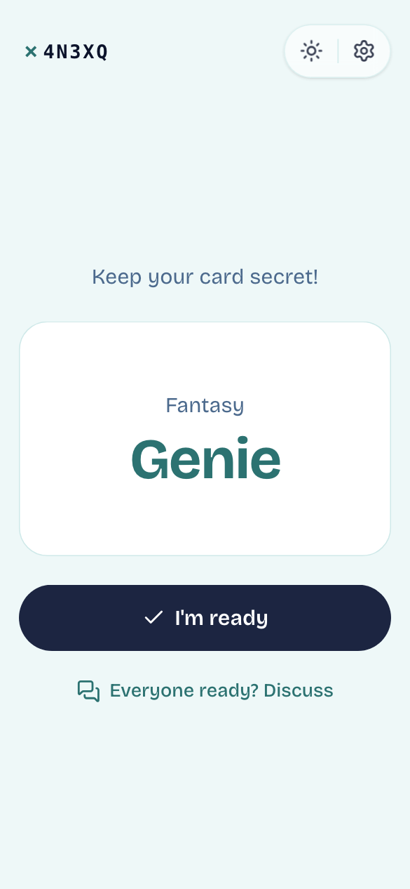

- Everyone taps **Tap to reveal** on their own phone. Tap the card again to hide it, and use **My card** later to peek again.
- After looking at their card, everyone taps **I'm ready**. When all players are ready, the discussion starts by itself.
- **Turns are guided:** the phone of the player whose turn it is says **Your turn!**. They say one word and tap **Done**; the next player is shown on everyone's screen. After everyone has spoken, the host picks **Another round of words** or **Vote**.
- The **host** moves the game on: *Vote* → *Play again*. Everyone else sees *"The host continues"*.
- The host's **word language** applies to the whole room, so everyone gets the same word. Each phone keeps its own app language, and the lobby shows the word language under *Game settings*.
- If the caught imposter may guess, their phone shows a field for the word while the others wait.
- **Votes** and **own words** are entered on each phone at the same time. The screen shows how many players are still missing.
- **Early voting** (host setting, off by default): during the discussion everyone can tap a suspect under *Your suspect* and change it as often as they like. Nobody sees the others' picks. With the result, *How the votes moved* shows one column per change of mind, stacked by suspect, up to the final vote, with the imposter marked.
- **A phone dropped out?** While waiting for votes, words or the imposter's guess, the host can tap **Continue without them**: the game counts what's there and moves on.
- Stats and jokers work the same as on one phone.

 

---

## 8. Settings

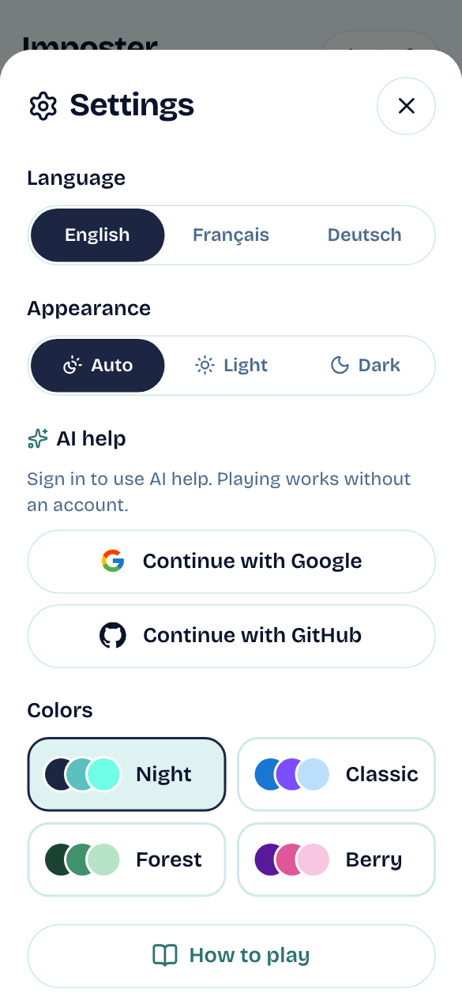

On a phone, a banner offers to **add Imposter to your home screen** so it opens full-screen and works offline, like a native app. Tap **Add** (Android) or use Share → Add to Home Screen (iPhone), or **Not now** to dismiss it.

The **sun/moon** button at the top right switches between light and dark mode. The **gear** opens Settings. Both stay in the top right corner while you scroll, on every screen:

- **Language:** English, Français, Deutsch, for buttons and texts. The language of the secret words is set separately in the game setup (*Word language*).
- **Appearance:** Auto (follows your phone), Light or Dark.
- **AI help:** sign in with Google, GitHub or Microsoft, or with your email (type it in, tap **Email me a code**, enter the 6-digit code from the mail, which comes in the app's language; it works for 5 minutes) to use it; once signed in, a switch turns it on or off, and **Sign out** is right below. Playing never needs an account; the sign-in only keeps the AI from being abused.
- **Colors:** Night, Classic, Forest, Berry, Arosa (blue and sun yellow) or Aarau (red and black).
- **Buy me a coffee:** a small thank-you to the maker, if you like the game: CHF 1 (small coffee), CHF 5 (big coffee), CHF 10 (deluxe coffee), or any whole amount up to CHF 200. The money goes to Zettelispiil, the maker of Imposter (the footer of Settings says *Imposter by Zettelispiil*). You pay on Stripe's secure page (card, TWINT, Apple Pay or Google Pay, whatever it offers you) and come straight back to the game, where Settings says thank you. Not shown in the App Store / Play Store apps.

Your choices are remembered on your phone.

 

---

## 9. Tips, house rules and FAQ

**Tips for the crew**
- Pick words that prove you know the secret without giving it away: *"towel"* is better than *"sand and sea"*.
- Listen for words that are a bit off, or copied from the person before.

**Tips for the imposter**
- Wait and listen: speaking late gives you more to go on.
- Stay general but confident. Topic words (*sunny* for Places) are your friend.

**House rules to try**
- Two rounds of words before every vote.
- Time limit: 5 seconds per word.
- With 7+ players, use 2 imposters.

**FAQ**

| Question | Answer |
|---|---|
| Someone refreshed the page or pressed Back. | On one phone the game resumes where you left off. In a room, just open the link again. |
| We tapped the logo or want to stop. | Use **× Quit round**. It asks first, and a joker spent on the unfinished round is given back. |
| "Online rooms aren't available yet" | The server has no room storage configured. Play on one phone meanwhile. |
| The QR scanner says there's no camera access | Allow camera access for the site in your browser, or just type the 5-character code. |
| The AI didn't correct anything | AI help may be off, you may not be signed in, or a limit was reached (60 checks per minute and 200 per day per account, 1,000 per day overall). Exact duplicates are still caught. |
| Can I put it on my home screen like an app? | Yes. Android and computers: **Settings → Install app**. iPhone: Safari → Share → **Add to Home Screen** (Settings shows the steps). It opens full-screen with the mask icon, and **the one-phone game then works offline**: handy at a party with bad reception. Rooms and AI help still need a connection. |
| Is there an app in the stores? | Not yet. Installing from Settings gives you the same game as an app. Android and iPhone app builds exist (Capacitor) and load the same site, so they always have the latest version. |
| Two players have the same name | The app adds a number (*Tim*, *Tim 2*) so stats and jokers stay apart. |
| A word appeared that we already had | Pack words only repeat once every word in the chosen topics has been played. |
